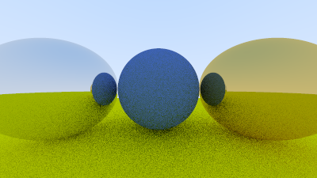

# RayTracing
Learning following RayTracingInOneWeekend.
More ppm images in image dir.

## images
### AA
- No AA \
  
- With Random AA \
  
- With 16x16 MSAA \
  

### 景深
- 

### 伽马矫正
- 

### 漫反射
- 

### 光源
- 

### 运动模糊
- 

### 材质
- 金属 \
  
- 折射与反射 \
  
  
  

### 纹理贴图
- 

### 综合场景
- 